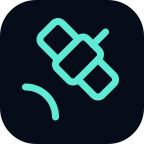

#  Starlink Monitor Br

[](https://github.com/roneydourados/starlink-monitor-br/releases)
[](https://github.com/roneydourados/starlink-monitor-br/releases/latest)
[](https://github.com/roneydourados/starlink-monitor-br/releases/latest)
[](#extensão-do-navegador-chrome-edge-firefox)
[](LICENSE)
[](https://github.com/roneydourados/starlink-monitor-br)
[](mailto:roneydourados@gmail.com)

App open-source de desktop para macOS, Windows e navegadores para monitorar o
desempenho e a saúde do seu Starlink. Este repositório é um fork brasileiro do
[Dishylink](https://github.com/DaveyHert/dishylink), com a marca
**Starlink Monitor Br**.

<picture>
  <source media="(prefers-color-scheme: dark)" srcset="landing/src/assets/shots/dashboard-dark.png">
  
</picture>

Ele lê a antena e o roteador diretamente pela sua rede local, então continua
funcionando durante uma outage — exatamente quando você mais quer ver o que
aconteceu. Sem conta, sem nuvem, sem telemetria: tudo o que grava fica na sua
própria máquina. Conectar uma conta Starlink é opcional. Isso adiciona plano e
números de faturamento e habilita controles do roteador suportados, como
pausar dispositivos conectados. A sessão permanece armazenada localmente e só
é enviada à Starlink.

##  Download

| Plataforma                                                                                   | Formato   | Arquitetura            |                                                                                                                                                          |
| :------------------------------------------------------------------------------------------- | :-------- | :--------------------- | :------------------------------------------------------------------------------------------------------------------------------------------------------: |
|  **macOS** 12+             | `DMG`     | `arm64`: Apple silicon |                                       [][latest]                                        |
|  **macOS** 12+             | `DMG`     | `x64`: Intel           |                                       [][latest]                                        |
|  **Windows** 10+         | `EXE`     | Universal              |                                       [][latest]                                        |
|  **Windows** 10+         | `EXE`     | `x64`                  |                                       [][latest]                                        |
|  **Windows** 10+         | `EXE`     | `arm64`                |                                       [][latest]                                        |
|  **Chrome** 144+ | Extensão  | Qualquer               | [](https://chromewebstore.google.com/detail/dishylink/pljgamnkfokhbchiiommnblkjffffnna) |
|  **Edge**          | Extensão  | Qualquer               | [](https://microsoftedge.microsoft.com/addons/detail/pknccegejhlgmeiojalenedmkbcaimdo)  |
|  **Firefox**    | Extensão  | Qualquer               |                     [](https://addons.mozilla.org/addon/dishylink/)                     |

[latest]: https://github.com/roneydourados/starlink-monitor-br/releases/latest

Não sabe qual escolher? No Windows, pegue Universal. No macOS, pegue `arm64`
para Apple silicon (M1 em diante) ou `x64` para Intel.

## Recursos

### O que mostra

- **Tiles de estatísticas**: downlink e uplink ao vivo, latência de pop-ping,
  consumo em watts, taxa de sucesso de ping em 60 segundos e fração de
  obstrução do céu. Cada um tem sparkline e abre num painel de detalhe.
- **Gráfico de throughput**: download e upload em janelas de 15m, 1h e 6h no
  dashboard, ou por dia, semana e mês a partir do histórico gravado — não só
  do que a aba atual viu.
- **Gráfico de latência**: agregação por _máximo_, para picos sobreviverem ao
  downsampling em vez de sumirem na média. Outages aparecem como faixas
  vermelhas.
- **Gráfico de energia e potência**: o que a antena realmente consome ao
  longo do tempo, com totais em kWh por dia, semana e mês, e lacunas honestas
  onde a gravação parou.
- **Mapa de obstrução do céu**: a grade SNR 123×123 da antena desenhada como
  um dome polar, com células obstruídas numa paleta de status.
- **Time-lapse de obstrução**: role snapshots horários do levantamento do céu,
  com LIVE como última parada.
- **Vista do céu**: cena em tela cheia do dome, da antena e da constelação de
  satélites passando. Clique em qualquer satélite para detalhes da passagem.
- **Dials de alinhamento**: rotação e inclinação contra a faixa desejada de
  azimute e elevação, portados do próprio web app da antena.
- **Uso de dados**: volume medido de download e upload por dia, semana e mês,
  mais **uso por dispositivo** do mês de faturamento a partir dos contadores
  por cliente do roteador. Nomeie dispositivos e veja fabricante, tipo e
  última vez visto.
- **Rede**: temperaturas dos rádios do roteador, lista de clientes, throughput
  por cliente e o log de eventos do próprio roteador.
- **Logs de eventos**: outages, eventos térmicos e um painel de terminal
  cobrindo firmware, GPS, alinhamento, roteadores mesh e alertas.
- **Teste de velocidade e alertas**: testes sob demanda, alertas por
  severidade com sino no app, e temas claro, escuro ou do sistema.
- **Aba de conta na nuvem** (opcional, opt-in): plano Starlink, ciclos de
  faturamento e uso mensal oficial, mais os controles autenticados que o
  roteador suporta.

### O que controla

Monitorar é só metade. A maioria das configurações escreve na antena ou no
roteador pela mesma API da LAN; controles que o firmware atual rejeita
localmente estão identificados abaixo como exigindo conexão opcional de conta
Starlink:

- **Derretimento de neve**: automático, sempre ligado ou desligado.
- **Agenda de sono**: desliga a antena por um número de horas por dia.
- **Atualizações de software**: escolha a janela de reboot, ou adie
  atualizações por 3 dias.
- **Manutenção**: reinicie a antena, limpe o mapa de obstrução aprendido e
  recolha/desça kits motorizados.
- **Roteador**: SSIDs e bandas, confiança de nós mesh, firmware e país, e
  reboot do roteador.
- **Endereço e sub-rede do roteador**: aponte o app a um roteador que não
  está no endereço padrão, e altere a faixa de endereços que o roteador
  distribui. Mudar a sub-rede exige conta conectada.
- **DNS customizado**: aponte o roteador aos seus próprios resolvers.
- **Modo bypass**: coloque o roteador em bridge mode para o seu próprio
  equipamento de rede.
- **Dispositivos conectados**: pause ou despause outro dispositivo enquanto
  estiver conectado. Disponível no app desktop e no harness web de
  desenvolvimento; exige sign-in opcional da conta Starlink: o app lê a
  configuração do roteador localmente, prepara a menor atualização de cliente
  aceita no host confiável e envia só ao endpoint autenticado da Starlink. O
  dispositivo rodando o Starlink Monitor Br não pode pausar a si mesmo — é o
  que **Seu dispositivo nesta rede** nas configurações fixa. A extensão do
  navegador não expõe esse controle porque extensões desktop comuns não leem
  de forma confiável o IP ou MAC da LAN do host. Embora a extensão possa
  enviar a atualização, ela não prova qual cliente do roteador é ela mesma e
  portanto não pode impedir o auto-pause com segurança.
- **Copiar dados de depuração**: diagnósticos + status + config em JSON, para
  relatos de bug.

Filtro de conteúdo deliberadamente _não_ é exposto: uma escrita ruim aí pode
derrubar o Wi‑Fi até um reset físico.

### Regras de rede

Meça qualquer dispositivo na rede e pause automaticamente quando ultrapassar
o limite.

- **Três tipos de limite**: cota de dados, agenda que pausa pelo relógio, ou
  contagem regressiva por um intervalo definido.
- **Um dispositivo ou um grupo**: meça um dispositivo sozinho, ou agrupe
  vários. Um grupo pode compartilhar a cota (membros gastam de um orçamento
  comum e acabam juntos) ou dar a cada membro a cota cheia de forma
  independente.
- **Uma lista para tudo**: toda regra da rede aparece num só lugar, seja
  criada ali ou no card do dispositivo, cada uma mostrando quanto do limite
  resta.
- As regras usam o mesmo pause com conta descrito acima, inclusive a proteção
  que impede o app de pausar o dispositivo em que está rodando.

## Três formas de rodar em desenvolvimento

O Starlink Monitor Br sai como três produtos independentes a partir de uma
base de código. Para rodar qualquer um a partir do fonte:

```bash
npm install

npm run dev              # harness web em localhost:5173
npm run dev:electron     # app desktop no Mac e Linux
npm run dev:electron:win # app desktop no Windows
npm run dev:extension    # extensão do navegador, carregada unpacked de .output/ (WXT)
```

No Windows use `dev:electron:win` em vez de `dev:electron`: ele define a
variável de ambiente via `cross-env` e pula a geração de ícone, nenhum dos
quais funciona bem num shell Windows.

Os três leem o hardware real, então você precisa estar na LAN Starlink para
algo aparecer. Testes e typechecks rodam em qualquer lugar.

Eles não conversam entre si nem compartilham runtime: cada um faz poll da
antena/roteador e grava o próprio histórico. Empacotamento:

```bash
npm run pack:mac        # build Mac
npm run pack:win        # build Windows
npm run build:extension # pacote da extensão Chromium
npm run build:extension:firefox
npm run build:extension:edge
docker compose up --build   # dashboard web + gravador, só nesta máquina
```

### Docker (navegador)

Empacota o dashboard web e o gravador de histórico num container. A imagem é
construída **só para a CPU da máquina em que você clona e builda** — amd64
num box x86, arm64 no Apple Silicon ou Raspberry Pi 64 bits. O Compose não
faz cross-build. Abra `http://localhost:8080`. O **host rodando Docker precisa
estar na LAN Starlink** — a antena (`192.168.100.1`) e o roteador
(`192.168.1.1`) são alcançados pelo host, não de dentro do Compose. Docker
Desktop não tem `--network host` de verdade; não configure isso.

```bash
docker compose up --build
```

Um Raspberry Pi 4/5 precisa do OS 64 bits e RAM suficiente para o build Vite
(4 GB é confortável; 2 GB muitas vezes dá OOM).

Gravações e uma sessão colada do starlink.com persistem no volume
`historian-data` — a sessão sobrevive a um reinício sem mount extra. Se
`com.dishylink.historian` já estiver rodando no launchd, pare-o primeiro —
dois gravadores dobram o poll de 200 ms de clientes do roteador.

Opcional, em `compose.yaml`:

- `HOST_LAN_IP` / `HOST_MAC` — o endereço LAN do host, para “Este dispositivo”
  e a proteção de auto-pause ainda funcionarem pelo publish de porta do Docker
  Desktop.

Escritas de sessão na nuvem ficam só em localhost. Abrir o dashboard pelo IP
LAN do host num celular ainda mostra dados ao vivo e histórico.

Útil enquanto trabalha:

```bash
npm run historian       # coletor de energia standalone, servindo /api/energy
npm run test:watch      # vitest em modo watch
npm run lint:fix        # eslint com --fix
```

Um build desktop novo abre sem histórico de propósito: ele se preenche
conforme roda.

### App desktop (Mac, Windows)

- Vive na bandeja / barra de menus e **continua gravando depois que a janela
  fecha**; só sai pelo Quit da bandeja.
- **Painel ao vivo de throughput** — taxas ↓/↑ na barra de menus do macOS, ou
  um pill arrastável always-on-top no Windows. Em qualquer superfície, a
  janela aberta alimenta quando há uma, e o gravador assume quando não há,
  para a antena nunca ser polled duas vezes.
- **Iniciar no Login**, abrindo oculto, para a coleta cobrir outages enquanto
  ninguém está olhando.
- Notificações nativas do SO para alertas quando a janela não está na frente,
  com throttle para um link oscilando não spammar.
- Auto-atualização, e lembra a posição da janela entre execuções e monitores.

### Extensão do navegador (Chrome, Edge, Firefox)

Instale pela
[Chrome Web Store](https://chromewebstore.google.com/detail/dishylink/pljgamnkfokhbchiiommnblkjffffnna),
[Edge Add-ons](https://microsoftedge.microsoft.com/addons/detail/pknccegejhlgmeiojalenedmkbcaimdo)
ou [Firefox Add-ons](https://addons.mozilla.org/addon/dishylink/).

- O ícone da barra abre o dashboard numa janela sem chrome (padrão) ou numa
  aba comum — nunca num popup apertado da toolbar.
- **Badge da toolbar** — o número de alertas ativos agora, tingido pela pior
  severidade, para ler igual fora do app e no sino de dentro.
- **Gravação** — depósito próprio de histórico no IndexedDB, preenchido por um
  tick de 30s do `chrome.alarms` que sobrevive ao teardown do service worker,
  com lacunas honestas de cobertura quando o navegador estava fechado.
- Chrome 144+ — abaixo disso um bug de Local Network Access faz o worker
  coletar nada em silêncio.

Fluxo de desenvolvimento:

```bash
npm test                # vitest
npm run typecheck       # tsc -b
npm run lint            # eslint
```

Diagnósticos:

```bash
node scripts/debug-decode.mjs <captured-body.bin>   # decodifica uma resposta capturada
node scripts/debug-browser.mjs                      # sonda o caminho de fetch no Chrome headless
```

## Como fala com a antena e o roteador

A antena serve a API em `192.168.100.1` em duas portas; o roteador responde
uma API correspondente no próprio endereço LAN:

| Porta | Protocolo               | Notas                                   |
| ----- | ----------------------- | --------------------------------------- |
| 9200  | gRPC nativo (HTTP/2)    | usado pelo `grpcurl`, tem reflection    |
| 9201  | **grpc-web** (HTTP/1.1) | o que este app usa a partir do navegador |

Dois quirks descobertos na construção (ambos tratados pelo proxy Vite no
dev, e pelo transporte próprio do host no Electron/extensão):

1. **Allowlist de CORS** — a porta 9201 só responde preflights CORS para a
   origem da própria antena, então uma página de terceiros não chama
   cross-origin.
2. **Guarda de Referer** — requisições com `Referer` não reconhecido recebem
   um 200 vazio; o transporte remove `Referer`/`Origin` antes de encaminhar.

O schema protobuf **não é adivinhado**: `schema/dish.protoset` foi dumpado do
próprio serviço de reflection gRPC da antena e é decodificado em runtime com
`@bufbuild/protobuf` (`core/dishClient.ts`). Para atualizar o schema após uma
atualização de firmware:

```bash
grpcurl -plaintext -protoset-out schema/dish.protoset \
  192.168.100.1:9200 describe SpaceX.API.Device.Device
cp schema/dish.protoset public/dish.protoset
```

O buffer circular de histórico da antena (900 amostras @ 1 Hz) é desenrolado
via contador absoluto de amostras (`core/telemetry.ts`); note que ele reporta
timestamps de `outages[]` na **época GPS** enquanto `eventLog` usa Unix — o
conversor leva em conta os 18 leap seconds. Veja `LOCAL-API.md` para o
conjunto completo de comportamentos medidos, quirks e campos sem saída neste
firmware.

## Histórico gravado

A antena e o roteador só guardam alguns minutos a algumas horas localmente. Um
**gravador de histórico** sempre ligado (`collector/`, o “historian”) faz poll
contínuo e escreve registros locais append-only para as vistas dia/semana/mês
terem dados reais — nunca inventando através de uma lacuna; cada intervalo
reporta que fração foi realmente amostrada. Veja `collector/README.md` para
como roda e o formato em disco.

Tudo acima é só local de propósito: sua telemetria, seu histórico, seu
armazenamento, nunca transmitidos.

## Licença

MIT. Veja [LICENSE](LICENSE).

O Starlink Monitor Br é um projeto não oficial e independente, sem afiliação
à SpaceX ou à Starlink. Starlink é marca registrada da Space Exploration
Technologies Corp.
